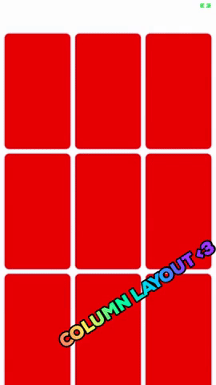

# ColumnLayout


## Welcome to ColumnLayout
ColumnLayout is a very powerful layout manager that aims at providing a simple API to create a column based layout on any collectionView.
ColumnLayout is also inspired by the commonly called « PinterestLayout »  where you can vary the height of any individual cell.




## How to use
```
public protocol ColumnLayoutDelegate: class {
    func numberOfColumnsFor(section: Int) -> Int
    func heightForCellAt(indexPath: IndexPath) -> CGFloat
    func referenceHeightForHeaderInSection(section: Int) -> CGFloat
    func insetForSectionAtIndex(section: Int) -> UIEdgeInsets
    func minimumInteritemSpacingForSection(section: Int) -> CGFloat
    func minimumLineSpacingForSection(section: Int) -> CGFloat
}
```

The ColumnLayoutDelegate protocol can be implemented in any class inheriting from NSObject.
First, you can define a number of columns in the method **numberOfColumnsFor(section: Int)** for a given section.
You can also vary the insets and inter item spacing between cells for a given section.
The method **heightForCellAt(indexPath: IndexPath)** allows you to vary the height of any individual cell. Please see the example project provided to see the basic implementation in details.

## Special Effects
```
public protocol CLLayoutEffectDelegate: class {
 static func computeEffectWithAttributes(attributes: [UICollectionViewLayoutAttributes], collectionView: UICollectionView)
}
```

The ** CLLayoutEffectDelegate** protocol can be implemented in any class inheriting from NSObject.  The method **func computeEffectWithAttributes(attributes: [UICollectionViewLayoutAttributes], collectionView: UICollectionView)** provides you two parameters:
* attributes: An **array of UICollectionViewLayoutAttributes** which can be altered as needed to implement any special effect.
* collectionView: The **UICollectionView** associated to the attributes.

Two special effects are built-in the project and can be used as example to implement your own custom one. They are contained in the /Effects folder.
The first one is **CLStretchyHeaderEffect**. It enables you to implement a very nice stretchable header.
